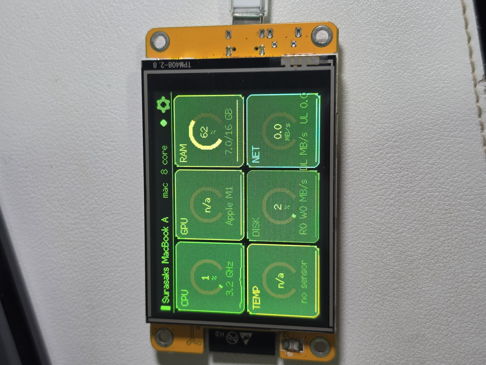
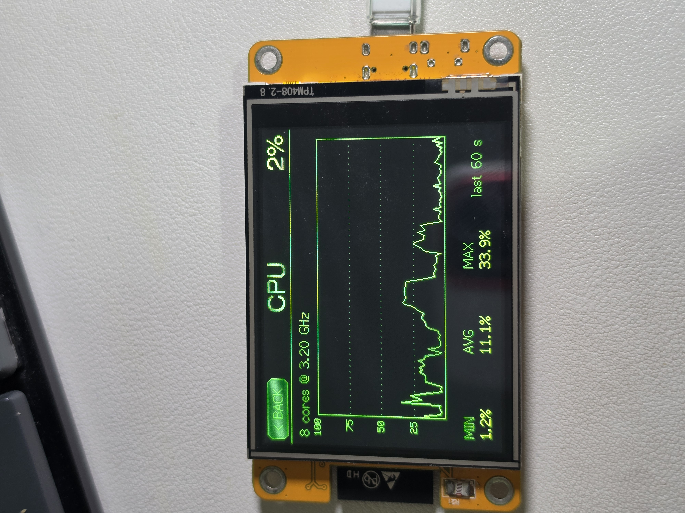
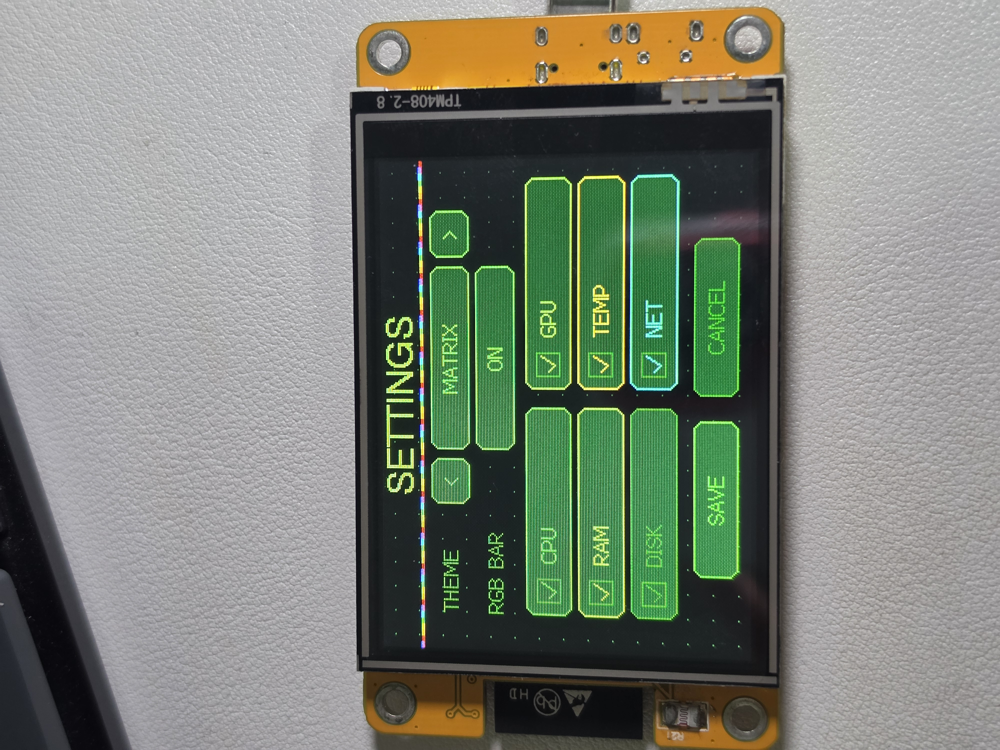

# 📊 CYD Resource Monitor

[English](README.md) · **ภาษาไทย**

จอมอนิเตอร์ทรัพยากรเครื่อง PC/Mac บน **บอร์ด ESP32 พร้อมจอทัช 2.8 นิ้ว ราคาหลักร้อย** (ตระกูล CYD "Cheap Yellow Display") — สาย USB เส้นเดียวได้ทั้งไฟและข้อมูล ไม่ต้องตั้งค่า WiFi ไม่ต้องต่อสายเพิ่ม ไม่ต้องลง driver


<!-- ภาพตัวอย่าง: วางรูปใน images/ ตามชื่อไฟล์นี้ -->


| | |
|---|---|
|  |  |
| แตะ tile ไหนก็ได้ → กราฟย้อนหลัง 60 วินาที พร้อม MIN / AVG / MAX | เลือก tile, ธีม และแถบ RGB — บันทึกลง flash ถาวร |

## ฟีเจอร์

- **Dashboard** — tile CPU / GPU / RAM / TEMP / DISK / NET พร้อมเกจโดนัท, sparkline แบบ area-fill, layout ปรับอัตโนมัติตามจำนวน tile ที่เปิด (1–6)
- **ธีม 4 แบบ** สลับได้บนจอเลย: `CYBER` (neon บนดำ), `SYNTHWAVE` (ม่วง/ชมพู/ส้ม), `MATRIX` (เขียวล้วน), `LIGHT` (โหมดสว่าง)
- **แถบ RGB วิ่ง** ใต้ header สไตล์เมนบอร์ดเกมมิ่ง — ปิดได้ในหน้า Settings ถ้าไม่ชอบ
- tile ไหนโหลดเกิน 85% **ขอบกระพริบแดง** เตือน
- **หน้า Detail** — แตะ tile เพื่อดูกราฟ 60 วินาที, MIN/AVG/MAX, ชื่อ GPU, สถานะการ์ดแยก/ออนบอร์ด, VRAM
- **ตรวจจับการ์ดจอแยก** — agent ส่ง GPU ทุกตัวที่เจอ เรียงการ์ดแยกขึ้นก่อน
- การตั้งค่าทั้งหมดเก็บใน NVS flash ไม่หายแม้ถอดไฟ

## สถาปัตยกรรม

```
┌─────────────┐  JSON lines @ 2 Hz   ┌──────────────┐
│   PC / Mac   │ ──── USB serial ────▶│  CYD display  │
│ monitor_agent│      115200 baud     │   firmware    │
└─────────────┘                      └──────────────┘
```

โปรโตคอลเป็น line-delimited JSON ที่ไม่ผูกกับ transport — อนาคตจะเปลี่ยนไปส่งผ่าน WebSocket ก็ได้โดยไม่ต้องแก้ format และไม่ต้องลง driver ใดๆ เพราะชิป CH340 บนบอร์ดรองรับในตัวทั้ง macOS (Big Sur ขึ้นไป) และ Windows 10/11

## เกี่ยวกับบอร์ด

โปรเจคนี้รันบนบอร์ดจอ ESP32 ขนาด 2.8 นิ้ว **ตระกูล CYD** ซึ่งมีผังขาตรงกับรุ่น `ESP32-2432S028R` ที่มีเอกสารอ้างอิงมากที่สุด — ค่าใน `platformio.ini` ตั้งตามผังขานี้ทั้งหมด

**👉 บอร์ดตัวที่ใช้จริงในโปรเจคนี้: [ดูที่ Shopee](https://s.shopee.co.th/30mqperiSK)** (พอร์ต USB-C, จอมีรหัส `TPM408-2.8`)

| ส่วนประกอบ | รายละเอียด |
|---|---|
| ชิป | ESP32-WROOM-32 ดูอัลคอร์ 240 MHz, flash 4 MB, ไม่มี PSRAM |
| จอ | ILI9341 ขนาด 2.8 นิ้ว 320×240, SPI ที่ 65 MHz |
| ทัชสกรีน | XPT2046 แบบ resistive (bit-bang: CLK 25, DIN 32, DOUT 39, CS 33) |
| USB-serial | CH340 — OS รองรับในตัว ไม่ต้องลง driver |

> ⚠️ บอร์ด CYD แต่ละล็อตไม่เหมือนกัน ถ้าสีเพี้ยนกลับด้าน ให้ลบ `-D TFT_INVERSION_ON=1` ออกจาก `platformio.ini` และถ้าจุดแตะไม่ตรง ให้แก้ค่า `touch.setCal(...)` ใน `src/main.cpp`

## เริ่มใช้งาน

### 1. Flash firmware

```bash
git clone https://github.com/moomdate/CYD-Resource-Monitor.git
cd CYD-Resource-Monitor
pio run -t upload
```

### 2. รัน agent บนเครื่องที่จะมอนิเตอร์

โหลดไฟล์สำเร็จรูปจาก [Releases](https://github.com/moomdate/CYD-Resource-Monitor/releases) — `cyd-monitor-agent-windows.exe` หรือ `cyd-monitor-agent-macos` — หรือรันจาก source:

```bash
cd agent
pip install -r requirements.txt
python monitor_agent.py          # หา port ของบอร์ดเองอัตโนมัติ
```

> หมายเหตุ macOS: ไฟล์จาก release ไม่ได้ code-sign — ครั้งแรกให้ right-click → Open

| ออปชัน | ใช้เมื่อ |
|---|---|
| `--list` | ดูรายชื่อ serial port |
| `--port COM5` | ระบุ port เอง |
| `--print` | ทดสอบพิมพ์ JSON โดยไม่ต้องต่อบอร์ด |
| `--interval 1` | ปรับความถี่ส่ง (ค่าเริ่มต้น 0.5 วินาที) |

### 3. ปลดล็อกข้อมูลเพิ่ม (ตามเครื่อง)

| ข้อมูล | ต้องทำอะไร |
|---|---|
| การ์ด NVIDIA (load/temp/VRAM) | `pip install pynvml` |
| Windows: อุณหภูมิ CPU + การ์ด AMD/Intel | รัน [LibreHardwareMonitor](https://github.com/LibreHardwareMonitor/LibreHardwareMonitor) เปิด Options → Remote Web Server (agent ต่อ `localhost:8085` ให้เอง) |
| macOS: อุณหภูมิ CPU | `brew install smctemp` |

Agent ออกแบบให้ degrade อย่างสุภาพ — ข้อมูลไหนไม่มี จอขึ้น `n/a` แทน ไม่พังทั้งระบบ

> ⚠️ **ข้อจำกัด macOS**: Apple ล็อกการอ่าน GPU load บน Apple Silicon ไว้หลัง API ที่ต้องใช้ sudo จอจึงแสดง GPU load เป็น `n/a` บน Mac ส่วน Windows ได้ครบทุกอย่างถ้ารัน LibreHardwareMonitor

## Release อัตโนมัติ (CI)

push tag ขึ้นต้นด้วย `v` แล้ว GitHub Actions จะ build และแนบไฟล์เข้า Release ให้เอง:

```bash
git tag v1.0.0 && git push origin v1.0.0
```

| ไฟล์ | สร้างบน |
|---|---|
| `cyd-monitor-agent-windows.exe` | windows-latest (PyInstaller — ไม่ต้องมี Python) |
| `cyd-monitor-agent-macos` | macos-latest |
| `cyd-resource-monitor-firmware.bin` | ubuntu-latest (PlatformIO) |

## โครงสร้างโปรเจค

```
agent/
└── monitor_agent.py   # Python agent (Windows + macOS)
src/
├── config.h           # ขาต่างๆ
├── ui.h               # sprite renderer, ธีม, ทัช, widget
├── data.h             # JSON parse, history ring, การตั้งค่า NVS
├── dash.h             # dashboard grid
├── detail.h           # หน้ากราฟรายตัว
├── settings.h         # เลือกธีม / RGB / tile
└── main.cpp           # loop + สลับหน้าจอ
```

## สัญญาอนุญาต

[MIT](LICENSE) — เอาไปใช้ต่อได้ตามสบาย ถ้าให้เครดิตกลับมาก็จะดีมาก
